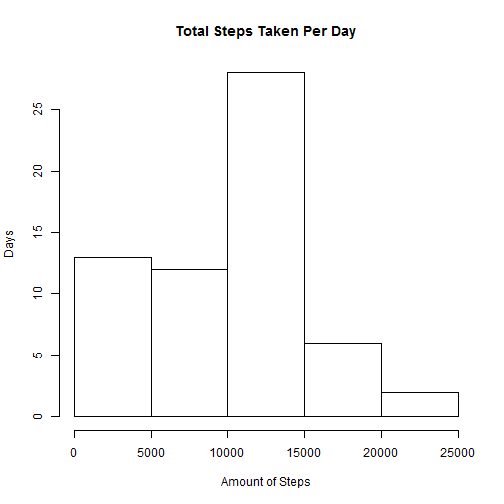
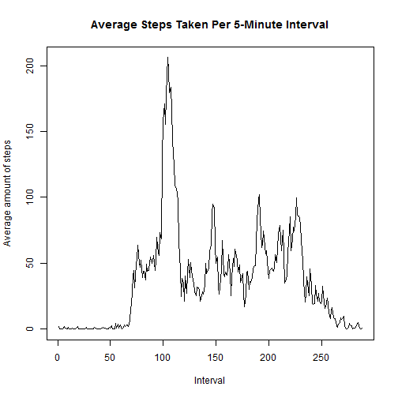
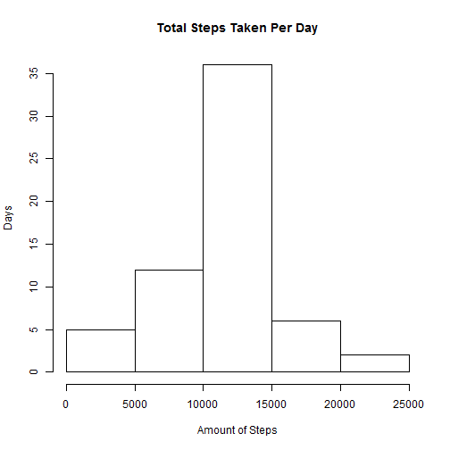
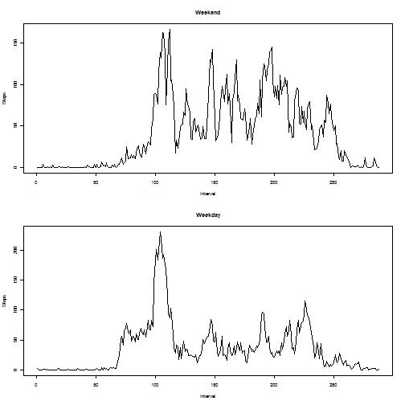

## Loading and preprocessing the data


```r
activity <- read.csv("activity.csv")
activity$date <- as.Date(activity$date)
```

## What is mean total number of steps taken per day?


```r
splitDay <- split(activity, activity$date)
totalSteps <- sapply(splitDay, function(x) sum(x[,"steps"], na.rm = TRUE))

hist(totalSteps, main = "Total Steps Taken Per Day",
     xlab = "Amount of Steps", ylab = "Days")
```

 

```r
summary(totalSteps)
```

```
##    Min. 1st Qu.  Median    Mean 3rd Qu.    Max. 
##       0    6778   10400    9354   12810   21190
```

## What is the average daily activity pattern?

```r
splitInval <- split(activity, activity$interval)
avgInval <- sapply(splitInval, function(x) mean(x[,"steps"], na.rm = TRUE))

plot(avgInval, type = "l",
     main = "Average Steps Taken Per 5-Minute Interval",
     xlab = "Interval", ylab = "Average amount of steps")
```

 

```r
avgInval[avgInval == max(avgInval)]
```

```
##      835 
## 206.1698
```

## Imputing missing values
Each missing value is imput with the mean for the relevant 5-minute interval.

```r
sum(is.na(activity$steps))
```

```
## [1] 2304
```

```r
imputActivity <- activity
for(i in which(is.na(activity$steps))) {
        inval <- activity$interval[i]
        imputActivity$steps[i] <- avgInval[as.character(inval)]
}

impSplitDay <- split(imputActivity, imputActivity$date)
totImpSteps <- sapply(impSplitDay, function(x) sum(x[,"steps"], na.rm = TRUE))
hist(totImpSteps, main = "Total Steps Taken Per Day",
     xlab = "Amount of Steps", ylab = "Days")
```

 

```r
summary(totImpSteps)
```

```
##    Min. 1st Qu.  Median    Mean 3rd Qu.    Max. 
##      41    9819   10770   10770   12810   21190
```

## Are there differences in activity patterns between weekdays and weekends?
The following graphs use the number of steps *after* imputing missing values.

```r
imputActivity$weekend <- "weekday"
imputActivity$weekend[which(weekdays(imputActivity$date)
                            == "Saturday"
                            | weekdays(imputActivity$date)
                            == "Sunday")] <- "weekend"
imputActivity$weekend <- as.factor(imputActivity$weekend)

weekdayActivity <- subset(imputActivity, imputActivity$weekend == "weekday")
weekendActivity <- subset(imputActivity, imputActivity$weekend == "weekend")
splitWeekdayInval <- split(weekdayActivity, weekdayActivity$interval)
splitWeekendInval <- split(weekendActivity, weekendActivity$interval)
avgWeekdayInval <- sapply(splitWeekdayInval, function(x) mean(x[,"steps"]))
avgWeekendInval <- sapply(splitWeekendInval, function(x) mean(x[,"steps"]))

par(mfrow = c(2, 1), cex = 0.5)
plot(avgWeekendInval, type = "l",
     main = "Weekend",
     xlab = "Interval", ylab = "Steps")
plot(avgWeekdayInval, type = "l",
     main = "Weekday",
     xlab = "Interval", ylab = "Steps")
```

 
